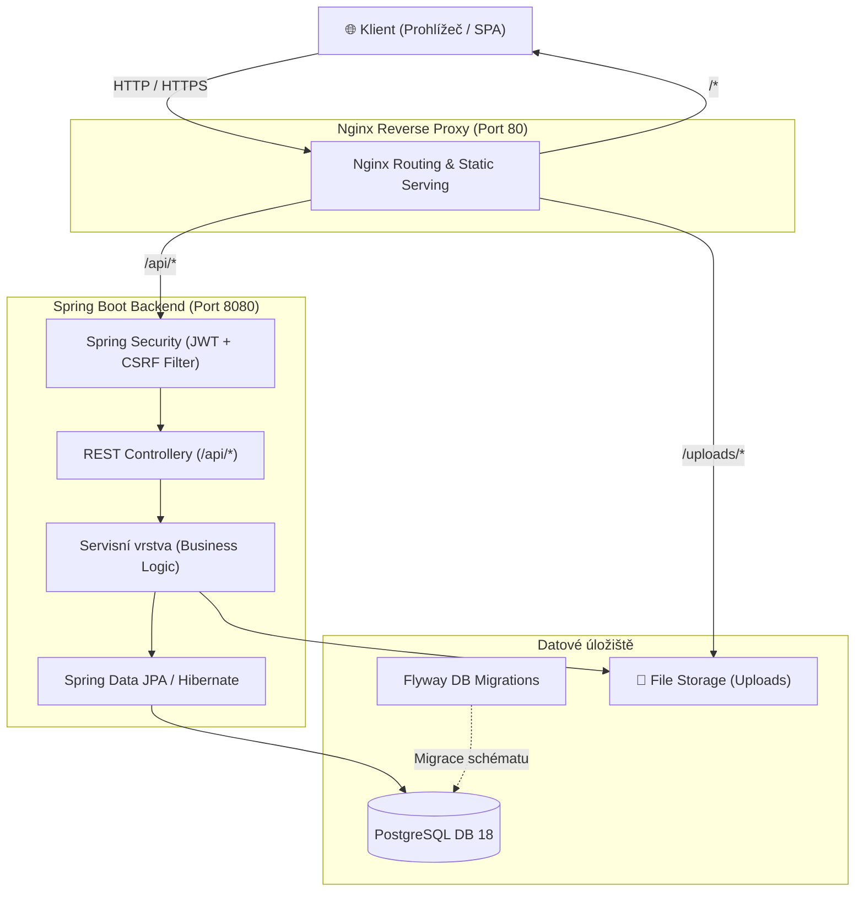
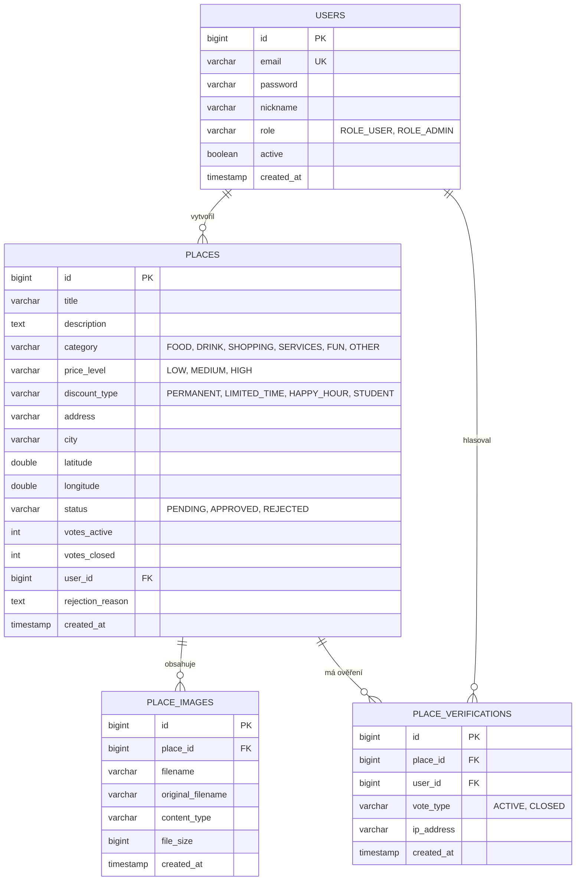

# 🥖 Žebrák App – Komunitní portál pro slevy a výhodná místa

[](https://spring.io/projects/spring-boot)
[](https://openjdk.org/)
[](https://angular.dev/)
[](https://www.postgresql.org/)
[](https://www.docker.com/)
[](http://localhost:8080/swagger-ui.html)

> **Žebrák App** je moderní full-stack webová aplikace určená pro objevování, sdílení a komunitní ověřování studentských slev, výhodných nabídek, levného jídla, pití, akcí a podniků.

---

## 📑 Obsah

1. [Klíčové funkce](#-klíčové-funkce)
2. [Architektura systému](#-architektura-systému)
3. [Technologický stack](#-technologický-stack)
4. [Struktura repozitáře](#-struktura-repozitáře)
5. [Datový model](#-datový-model)
6. [Bezpečnostní architektura](#-bezpečnostní-architektura)
7. [Přehled REST API](#-přehled-rest-api)
8. [Rychlý start (lokální vývoj)](#-rychlý-start-lokální-vývoj)
9. [Spuštění v Dockeru (Produkce / Staging)](#-spuštění-v-dockeru-produkce--staging)
10. [Testování a kvalita kódu](#-testování-a-kvalita-kódu)

---

## 🌟 Klíčové funkce

* 🗺️ **Interaktivní mapa & Geolokace**: Zobrazení všech ověřených podniků a akcí na mapě (Mapy.cz API) s filtrováním dle polohy, kategorií a cenové hladiny.
* 🏷️ **Katalog a pokročilé filtry**:
  * **Kategorie**: Jídlo, Pití, Nákupy, Služby, Zábava, Ostatní.
  * **Cenová hladina**: Nízká ($), Střední ($$), Vysoká ($$$).
  * **Typ slevy**: Trvalá, Časově omezená, Happy Hour, Studentská (ISIC).
* 👍 **Komunitní ověřování (Crowdsourced Verification)**: Uživatelé hlasují, zda sleva stále platí (Aktivní vs. Uzavřeno/Neplatné).
* 🛡️ **Administrátorský schvalovací proces**: Nově přidaná místa prochází moderací (Pending -> Approved / Rejected s uvedením důvodu).
* 📸 **Bezpečný upload fotografií**: Možnost nahrávat fotky k místům s ochranou proti škodlivým souborům a Path Traversal útokům.
* 🔐 **Robustní zabezpečení**: JWT autentizace uložená v HttpOnly / SameSite cookies, CSRF ochrana (Double Submit Cookie), Role-Based Access Control (`ROLE_USER`, `ROLE_ADMIN`).
* 📖 **Interaktivní API dokumentace**: Swagger UI / OpenAPI 3.0 pro testování všech endpointů přímo v prohlížeči.

---

## 🏛️ Architektura systému

Aplikace je navržena jako moderní **Single Page Application (SPA)** komunikující s **REST API backendem**:



---

## 💻 Technologický stack

### Backend (`ZebrakApp`)
* **Jazyk & Platforma**: Java 25 / Spring Boot 4.1.0
* **Zabezpečení**: Spring Security 7, JJWT (io.jsonwebtoken 0.12.6), BCrypt
* **ORM & Databáze**: Spring Data JPA, Hibernate 7, PostgreSQL 18
* **Databázové migrace**: Flyway 12
* **API Dokumentace**: Springdoc OpenAPI UI 2.8.5 (Swagger 3)
* **Utility & Nástroje**: Lombok, Jakarta Validation, Maven Wrapper

### Frontend (`frontend`)
* **Framework**: Angular 21+ (Standalone Components, Signals API, Typed Forms)
* **Jazyk**: TypeScript 5+, HTML5, Vanilla CSS3 (Custom Design Tokens)
* **Mapová integrace**: Mapy.cz REST API / Mapové podklady
* **Komunikace**: Angular `HttpClient`, RxJS, Http Interceptors (Auth & CSRF)

### DevOps & Infrastruktura (`deploy`)
* **Kontejnerizace**: Docker & Multi-stage Dockerfiles
* **Orchestrace**: Docker Compose
* **Web Server & Proxy**: Nginx Alpine

---

## 📁 Struktura repozitáře

```text
ŽEBRÁK/
├── .dockerignore                 # Globální pravidla pro ignorování souborů v Dockeru
├── .gitignore                    # Kořenový gitignore pro Java, Angular, Docker i IDE
├── README.md                     # Hlavní dokumentace projektu
│
├── ZebrakApp/                    # ☕ Backend aplikace (Spring Boot)
│   ├── .env.example              # Vzorové proměnné prostředí pro backend
│   ├── pom.xml                   # Maven konfigurace a závislosti
│   ├── compose.yaml              # Lokální vývojový Docker Compose pro PostgreSQL
│   └── src/
│       ├── main/java/hanzner/zebrakapp/
│       │   ├── config/           # Konfigurace (Security, OpenAPI, WebMvc, CORS)
│       │   ├── controller/       # REST Controllery (Auth, Place, Admin, User...)
│       │   ├── dto/              # Request / Response Data Transfer Objekty
│       │   ├── entity/           # JPA Entity (User, Place, PlaceImage, Verification...)
│       │   ├── exception/        # Vlastní výjimky a GlobalExceptionHandler
│       │   ├── repository/       # Spring Data JPA repozitáře
│       │   ├── security/         # JWT Provider, Filtry, UserDetailsService
│       │   └── service/          # Aplikační a doménová logika
│       ├── main/resources/
│       │   ├── application.yml   # Hlavní konfigurace aplikace
│       │   └── db/migration/     # Flyway SQL migrační skripty (V1, V2...)
│       └── test/                 # Integrační a bezpečnostní testy (44+ testů)
│
├── frontend/                     # 🅰️ Frontend aplikace (Angular)
│   ├── package.json              # NPM závislosti a skripty
│   ├── angular.json              # Konfigurace Angular CLI
│   ├── proxy.conf.json           # Dev proxy pro lokální volání /api
│   └── src/
│       ├── app/
│       │   ├── components/       # Znovupoužitelné komponenty (Map, Cards, Modals...)
│       │   ├── core/             # Služby (API, Auth, Mapy), Modely, Guardy, Interceptory
│       │   └── pages/            # Stránky (Home, Admin Dashboard, Moje Místa)
│       ├── index.html            # Hlavní HTML šablona
│       └── styles.css            # Globální CSS proměnné a design systém
│
├── deploy/                       # 🚀 Konfigurace pro nasazení
│   ├── .env.example              # Šablona proměnných pro Docker Compose stack
    ├── docker-compose.yml        # Multi-container stack (Postgres + Backend + Frontend + Nginx)
    ├── Dockerfile.backend        # Multi-stage Dockerfile pro Spring Boot
    └── nginx/default.conf        # Nginx konfigurace s reverzní proxy a CORS


```

---

## 🗄️ Datový model



---

## 🔒 Bezpečnostní architektura

Projekt implementuje bezpečnostní standardy podle **OWASP Top 10**:

1. **Autentizace & Session Management**:
   - Bezstavové JWT tokeny podepsané algoritmem `HMAC-SHA256` (klíč minimálně 256 bitů).
   - Tokeny jsou distribuovány v zabezpečených `HttpOnly`, `SameSite=Lax` cookies, což eliminuje riziko krádeže tokenu přes XSS útoky.
2. **CSRF Ochrana (Cross-Site Request Forgery)**:
   - Implementován Double-Submit Cookie pattern s `CookieCsrfTokenRepository(withHttpOnlyFalse)`.
   - Speciální filtr `CsrfCookieFilter` zajišťuje bezpečné předání CSRF tokenu frontendové aplikaci.
3. **Obrana proti Path Traversal (LFI/RFI)**:
   - Služba `ImageStorageService` striktně validuje a normalizuje názvy souborů při ukládání, načítání i mazání (`store`, `load`, `delete`).
   - Zakazuje použití znaků `..`, `/` a `\` a kontroluje, že cílová cesta neopouští kořenový adresář `uploads/`.
4. **Validace vstupů & SQL Injection**:
   - Všechny vstupy jsou validovány pomocí anotací `@Valid`, `@NotBlank`, `@Size`.
   - Veškeré databázové operace využívají parametrizované dotazy přes Spring Data JPA a JPA Criteria API.
5. **Role-Based Access Control (RBAC)**:
   - `@EnableMethodSecurity` a bezpečnostní filtry zabezpečují citlivé endpointy (`/api/admin/**` je vyhrazeno pouze pro `ROLE_ADMIN`).

---

## 📡 Přehled REST API

Kompletní živá interaktivní dokumentace je k dispozici po spuštění na:  
👉 **`http://localhost:8080/swagger-ui.html`**

| Modul | Metoda | Endpoint | Oprávnění | Popis |
| :--- | :--- | :--- | :--- | :--- |
| **Auth** | `POST` | `/api/auth/register` | Veřejné | Registrace nového uživatele |
| **Auth** | `POST` | `/api/auth/login` | Veřejné | Přihlášení a vystavení JWT cookie |
| **Auth** | `POST` | `/api/auth/logout` | Přihlášený | Odhlášení a vymazání JWT cookie |
| **Auth** | `GET` | `/api/auth/me` | Přihlášený | Získání profilu přihlášeného uživatele |
| **Místa** | `GET` | `/api/places` | Veřejné | Vyhledávání a filtrování schválených míst |
| **Místa** | `GET` | `/api/places/{id}` | Veřejné | Detail konkrétního místa |
| **Místa** | `POST` | `/api/places` | Přihlášený | Vytvoření nového místa (status `PENDING`) |
| **Místa** | `PUT` | `/api/places/{id}` | Vlastník / Admin | Úprava existujícího místa |
| **Místa** | `DELETE` | `/api/places/{id}` | Vlastník / Admin | Smazání místa |
| **Místa** | `POST` | `/api/places/{id}/verify` | Veřejné / Přihlášený | Hlasování o platnosti nabídky |
| **Obrázky** | `POST` | `/api/places/{id}/images` | Vlastník / Admin | Nahrání fotografií k místu |
| **Obrázky** | `DELETE` | `/api/places/{id}/images/{imgId}` | Vlastník / Admin | Smazání fotografie |
| **Admin** | `GET` | `/api/admin/places/pending` | Pouze Admin | Seznam míst čekajících na schválení |
| **Admin** | `POST` | `/api/admin/places/{id}/approve` | Pouze Admin | Schválení místa do veřejného katalogu |
| **Admin** | `POST` | `/api/admin/places/{id}/reject` | Pouze Admin | Zamítnutí místa s odůvodněním |
| **Metadata**| `GET` | `/api/metadata/categories` | Veřejné | Seznam dostupných kategorií |

---

## 🚀 Rychlý start (lokální vývoj)

### Požadavky na prostředí
* **Java Development Kit (JDK)** verze 21 nebo 25
* **Node.js** v20+ a **NPM**
* **Docker Desktop** (pro běh lokální PostgreSQL databáze)

---

### Krok 1: Spuštění PostgreSQL databáze
V adresáři `ZebrakApp` spusťte připravený Docker Compose:
```powershell
docker compose -f ZebrakApp/compose.yaml up -d
```
*Tím se spustí PostgreSQL na portu `5432` s databází `mydatabase`.*

---

### Krok 2: Spuštění backendu (Spring Boot)

1. Nastavte proměnnou prostředí `JWT_SECRET` (v terminálu nebo ve svém IDE v Run Configuration):
   ```powershell
   # PowerShell:
   $env:JWT_SECRET="dGVzdFNlY3JldEtleUZvclplYnJha0FwcFRlc3RpbmdPbmx5TmVlZHNUb0JlQXRMZWFzdDI1NkJpdHNMb25nMTIzNDU2Nzg5MA=="
   ```
2. Spusťte aplikaci přes Maven Wrapper:
   ```powershell
   cd ZebrakApp
   ./mvnw spring-boot:run
   ```
*Backend poběží na `http://localhost:8080`. Flyway automaticky vytvoří tabulky a výchozího administrátora.*
* **Výchozí admin účet**: `admin@zebrak.cz` / `Admin123!`

---

### Krok 3: Spuštění frontendu (Angular)

V novém terminálu přejděte do složky `frontend`:
```powershell
cd frontend
npm install
npm start
```
*Frontend poběží na `http://localhost:4200` a automaticky přeposílá volání `/api` na běžící backend.*

---

## 🐳 Spuštění v Dockeru (Produkce / Staging)

Pro spuštění celého produkčního stacku (Nginx + Frontend + Backend + PostgreSQL) jedním příkazem:

1. Přejděte do složky `deploy` a vytvořte `.env` soubor ze šablony:
   ```powershell
   cd deploy
   cp .env.example .env
   ```
2. Upravte hesla a `JWT_SECRET` v souboru `deploy/.env`.
3. Spusťte celý stack:
   ```powershell
   docker compose up -d --build
   ```
4. Aplikace je dostupná na **`http://localhost`** (port 80).

---

## 🧪 Testování a kvalita kódu

Projekt obsahuje rozsáhlou sadu integračních, unitních a bezpečnostních testů pokrývajících:
* Autentizaci a generování JWT
* Role-Based Access Control (RBAC) a ochranu endpointů
* CSRF ochranu a Cookie manipulaci
* Prevenci SQL Injection a XSS
* Ochranu proti Path Traversal při manipulaci se soubory

### Spuštění všech testů:
```powershell
cd ZebrakApp
./mvnw test
```

Výsledek testů:
```text
[INFO] Results:
[INFO] Tests run: 44, Failures: 0, Errors: 0, Skipped: 0
[INFO] BUILD SUCCESS
```

---

## 📄 Licence
Tento projekt je vyvíjen jako komunitní platforma. Všechna práva vyhrazena.
